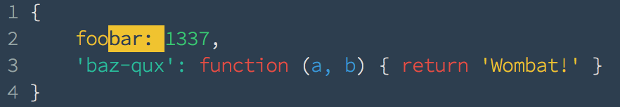
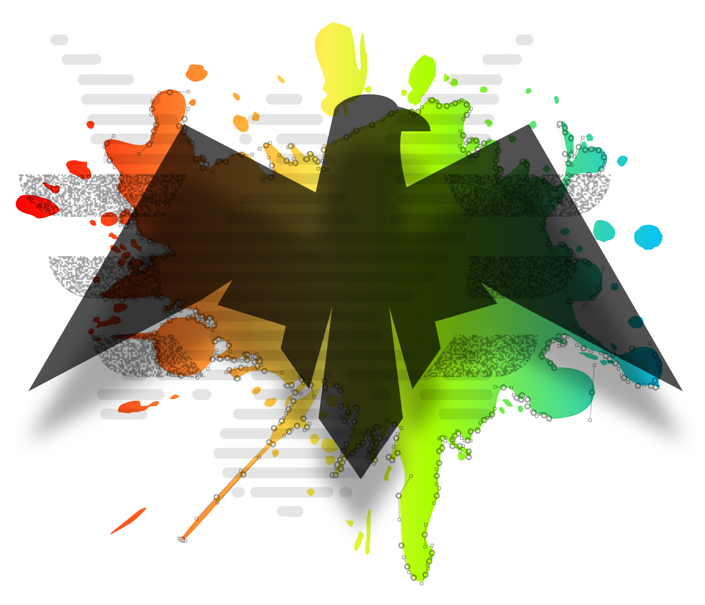
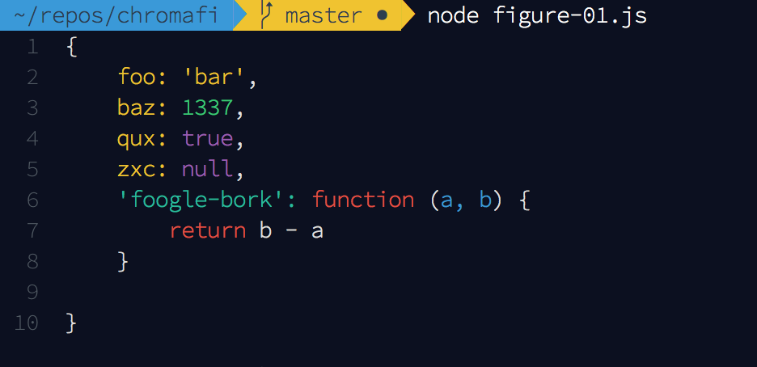
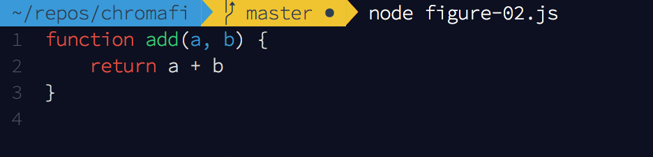
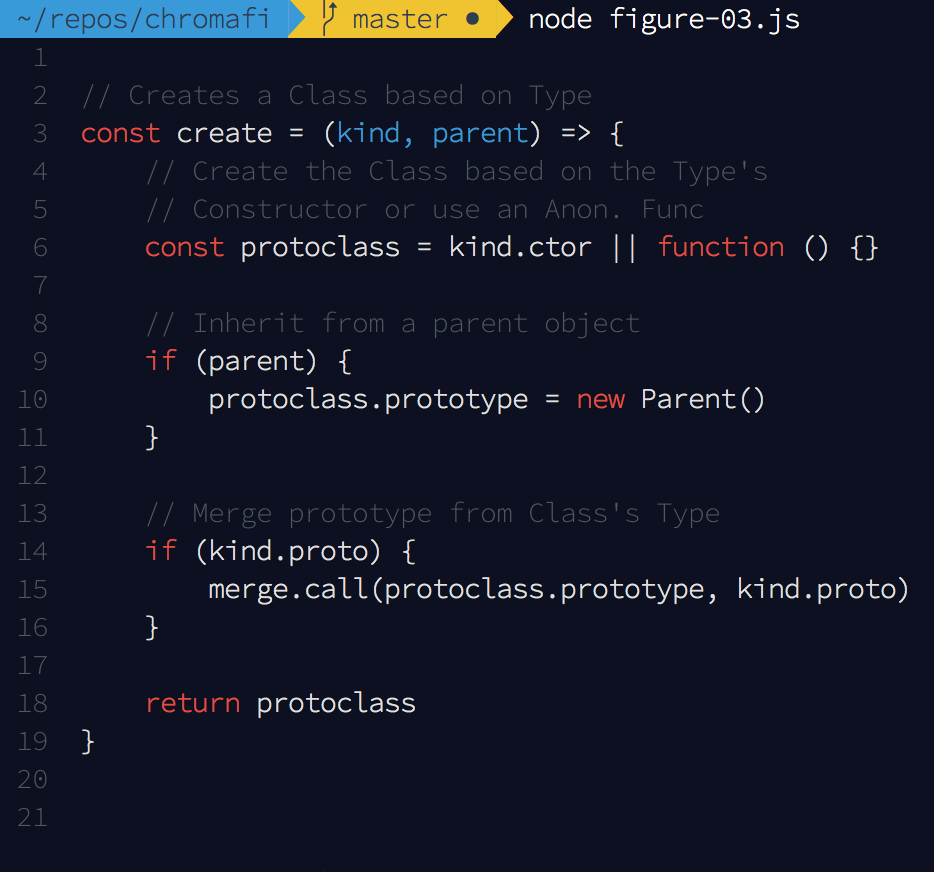
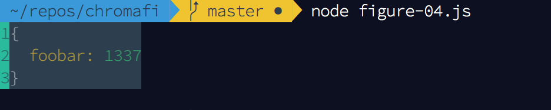
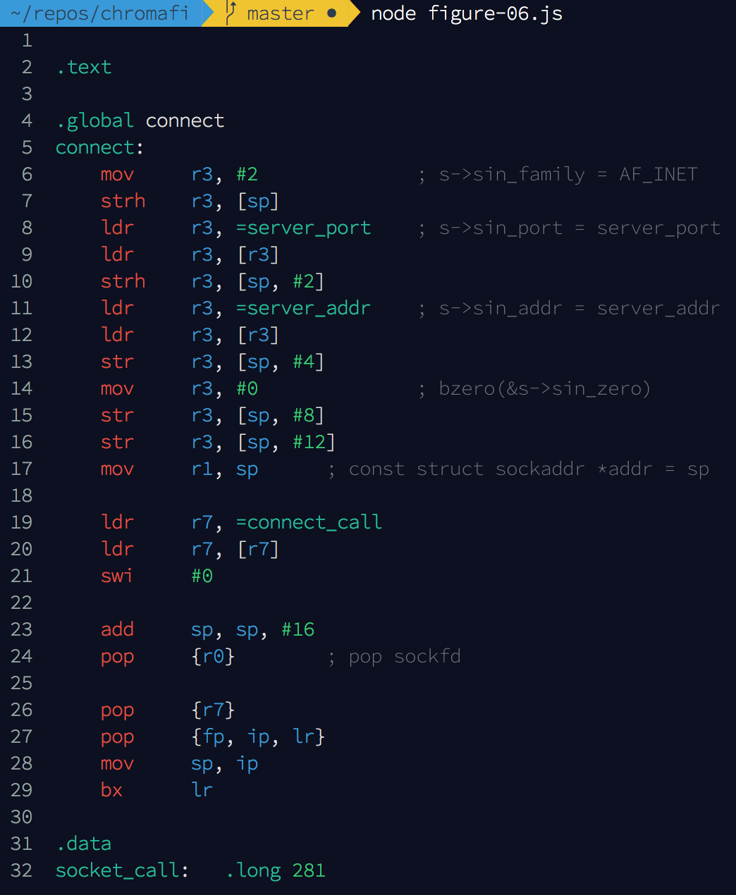

# Chromafi

[](https://travis-ci.org/F1LT3R/chromafi)
[](https://coveralls.io/github/F1LT3R/chromafi?branch=master)
[](https://www.npmjs.com/package/chromafi)
[](https://github.com/sindresorhus/xo)

> 🦅  cli syntax highlighting: any function - any object - 176 languages



## Fork notice

This is Truffle's customized fork of Chromafi.  The original Chromafi can be found [here](https://github.com/F1LT3R/chromafi).

The differences are as follows:

1. This fork allows colors to continue across lines.
2. This fork exposes the `hljs` object as `chromafi.hljs` so that it can be modified.
3. This fork uses `lodash.merge` instead of `deepmerge` for Webpack compatibility.

## Support

Support the development of Chromafi by [becoming a patreon](https://patreon.com/bePatron?u=9720216).

<a href="https://patreon.com/bePatron?u=9720216"></a>

## Features

<center></center>

* JavaScript objects that are logged to the console... still look like JavaScript objects.
* Chromafi highlights JavaScript functions.
* Adjust indentation for tabbed code with Chromafi.
* User defined color palettes.
* Line numbers optional.
* Padding adjustment for use with background colors or tight spaces.
* Chromafi also highlights strings of code in 176 languages.

## Usage

### Chromafi a JavaScript Object

```javascript
const chromafi = require('chromafi')

const obj = {
    foo: 'bar',
    baz: 1337,
    qux: true,
    zxc: null,
    'foogle-bork': function (a, b) {
        return b - a
    }
}

const chromatastic = chromafi(obj)

console.log(chromatastic)
```



### Chromafi a JavaScript Function

```javascript
const chromafi = require('chromafi')

function add (a, b) {
    return a + b
}

const chromantic = chromafi(add)

console.log(chromantic)
```



### Chromafi a String of Code

```javascript
const chromafi = require('chromafi')

const codeString = `
// Creates a Class based on Type
const create = (kind, parent) => {
    // Create the Class based on the Type's
    // Constructor or use an Anon. Func
    const protoclass = kind.ctor || function () {}

    // Inherit from a parent object
    if (parent) {
        protoclass.prototype = new Parent()
    }

    // Merge prototype from Class's Type
    if (kind.proto) {
        merge.call(protoclass.prototype, kind.proto)
    }

    return protoclass
}
`

const chromadactic = chromafi(codeString)

console.log(chromadactic)
```



## Options

```javascript
const chromafi = require('chromafi')
const chalk = require('chalk')

const obj = {foobar: 1337}

const options = {
    lineNumberPad: 0,
    codePad: 0,
    indent: 2,
    lineNumbers: true,
    colors: {
        base: chalk.bgBlack.white.bold,
        line_numbers: chalk.bgCyan.black
    }
}

const chromafanatic = chromafi(obj, options)

console.log(chromafanatic)

```



## Light Color Scheme

Chromafi uses [Chalk](https://github.com/chalk/chalk) to write ANSI color codes to the terminal.

```javascript
const chromafi = require('chromafi')

const chromafi = require('.')
const chalk = require('chalk')

const obj = {
    foo: 'bar',
    baz: 1337,
    qux: true,
    zxc: null,
    'foogle-bork': function (a, b) {
        return b - a
    }
}

const chromafantastic = chromafi(obj, {
    colors: {
        base: chalk.bgWhite.black.bold,
        keyword: chalk.red,
        number: chalk.blue.dim,
        function: chalk.black,
        title: chalk.blue,
        params: chalk.black,
        string: chalk.black,
        built_in: chalk.blue,
        literal: chalk.blue,
        attr: chalk.black,
        // Just pass `chalk` to ignore colors
        trailing_space: chalk,
        regexp: chalk.blue,
        line_numbers: chalk.bgBlue.white
    }
})

console.log(chromafantastic)
```


## Highlighting Other Languages

Chromafi uses [Highlight.js](https://highlightjs.org/) to syntax highlight to your code. This means Chromafi can highlight any language that `Highlight.js` can.

Let's Chromafi some assembler syntax:

```javascript
const chromafi = require('chromafi')

const armAssemblyCode = `
.text

.global connect
connect:
    mov     r3, #2              ; s->sin_family = AF_INET
    strh    r3, [sp]
    ldr     r3, =server_port    ; s->sin_port = server_port
    ldr     r3, [r3]
    strh    r3, [sp, #2]
    ldr     r3, =server_addr    ; s->sin_addr = server_addr
    ldr     r3, [r3]
    str     r3, [sp, #4]
    mov     r3, #0              ; bzero(&s->sin_zero)
    str     r3, [sp, #8]
    str     r3, [sp, #12]
    mov     r1, sp      ; const struct sockaddr *addr = sp

    ldr     r7, =connect_call
    ldr     r7, [r7]
    swi     #0

    add     sp, sp, #16
    pop     {r0}        ; pop sockfd

    pop     {r7}
    pop     {fp, ip, lr}
    mov     sp, ip
    bx      lr

.data
socket_call:   .long 281
connect_call:  .long 283

/* all addresses are network byte-order (big-endian) */
server_addr:            .long 0x0100007f ; localhost
server_port:            .hword 0x0b1a
`

const chromalicious = chromafi(armAssemblyCode, {lang: 'arm'})

console.log(chromalicious)
```



## Supported Languages

> 1c, abnf, accesslog, actionscript, ada, apache, applescript, arduino, armasm, asciidoc, aspectj, autohotkey, autoit, avrasm, awk, axapta, bash, basic, bnf, brainfuck, cal, capnproto, ceylon, clean, clojure-repl, clojure, cmake, coffeescript, coq, cos, cpp, crmsh, crystal, cs, csp, css, d, dart, delphi, diff, django, dns, dockerfile, dos, dsconfig, dts, dust, ebnf, elixir, elm, erb, erlang-repl, erlang, excel, fix, flix, fortran, fsharp, gams, gauss, gcode, gherkin, glsl, go, golo, gradle, groovy, haml, handlebars, haskell, haxe, hsp, htmlbars, http, hy, inform7, ini, irpf90, java, javascript, jboss-cli, json, julia-repl, julia, kotlin, lasso, ldif, leaf, less, lisp, livecodeserver, livescript, llvm, lsl, lua, makefile, markdown, mathematica, matlab, maxima, mel, mercury, mipsasm, mizar, mojolicious, monkey, moonscript, n1ql, nginx, nimrod, nix, nsis, objectivec, ocaml, openscad, oxygene, parser3, perl, pf, php, pony, powershell, processing, profile, prolog, protobuf, puppet, purebasic, python, q, qml, r, rib, roboconf, routeros, rsl, ruby, ruleslanguage, rust, scala, scheme, scilab, scss, shell, smali, smalltalk, sml, sqf, sql, stan, stata, step21, stylus, subunit, swift, taggerscript, tap, tcl, tex, thrift, tp, twig, typescript, vala, vbnet, vbscript-html, vbscript, verilog, vhdl, vim, x86asm, xl, xml, xquery, yaml, zephir


## Credits

Thank you to the following Noun Project artists for the vectors used in the lead graphic.

- [Yoshi](https://thenounproject.com/aure7/)
- [Tom Ingebretsen](https://thenounproject.com/tomplusplus/)
- [Roussy Lucas](https://thenounproject.com/lroussy/)
- [Wira](https://thenounproject.com/wirawizinda097/)
